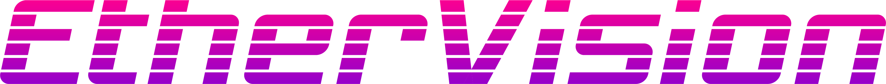

# EtherVision Whitepaper

## A full node open source software client for the SNGLS Media Distribution Protocol

## Architect:
Troy Murray

### Overview

EtherVision is the open source full node client that runs the SNGLS Media Distribution Protocol.  It will be fully documented so any team, individual or otherwise can easily dig in and add to it or create their own portal using it. The core piece of software will control three different elements, those being DAO governance (Alchemy), protocol/player initiator, and lastly the content mining mechanism.

### DAO Governance

We launched our the snglsDAO on July 4, 2020 and you can access webapp version of the DAO at https://app.snglsDAO.io.  The DAO uses the [Alchemy](https://github.com/daostack/alchemy) which will be baked into the EtherVision software package.  The DAO controls the 3 key protocol parameters of listing fee, transaction fee, and validation fee.  The DAO also has full control of the treasury and can interact with any trustless Ethereum based DAPP.  Users can also put in proposals for grants from the treasury that other DAO members can vote.  For more information on DAO controls please reference [the snglsDAO Whitepaper](https://github.com/SingularDTV/snglsDAO-whitepaper#iv-sngls-dao-governance).

### Protocol / Player Initiator

The software package will also include the protocol/player initiator.  This part of the package includes the seeding of the torrents mechanism and works as a full node on the protocol.  The torrents are hashed to Ethereum wallet addresses and allows artists to accept payment for their work using the uncensorable payment rails of Ethereum.  The player has a built in localized encryption system that is not dependent on a cloud service for the decryption key.  This provides artists with a DRM that can is not centrally secured.  

### Content Mining

The content mining mechanism is the final piece of the puzzle to full decentralize the system.  Content mining will allow the community to decide what gets added to the protocol and what doesn’t.  The mining mechanism will also serve as the on boarding of content area in the UI.  This where the user will include all information for the torrent and then submit it to the system to be “mined” onto the protocol. For a more technically detailed description of the content mining mechanism please reference [the snglsDAO Whitepaper](https://github.com/SingularDTV/snglsDAO-whitepaper#v-content-mining-1).

